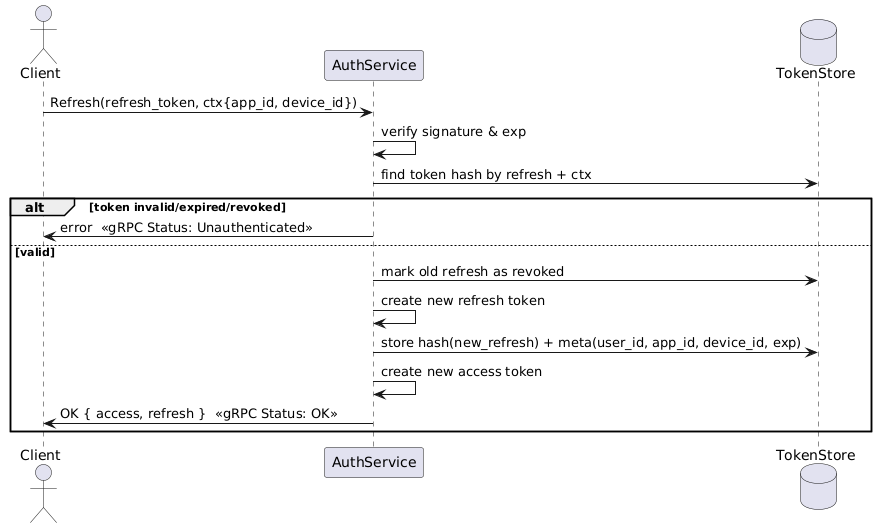

# Auth Service (SSO)

Сервис аутентификации и управления сессиями пользователей.  
Реализует регистрацию, логин, обновление токенов и выход из системы в соответствии с **RFC 6749** (OAuth 2.0).

Протокол gRPC и protobuf контракты находятся в репозитории: [https://github.com/eragon-mdi/protos](https://github.com/eragon-mdi/protos)

---

## Основные юзкейсы

### Auth Use Cases

  

---

## Последовательности операций

### Регистрация

  

### Логин

  

### Обновление токена (Refresh)

  

### Выход (Logout)

  

---

## Быстрый старт (Dev)

0. Скопировать `example.env` в `.env` и выставить свои значения.  
0. Сгенерировать ключи RSA для JWT:  

```bash
make gen-rsa-pair
```
## Для быстрого отладочного запуска

```bash
make dev-restart
make dev-up
make dev-down
```

## Для нормального запуска
```bash
make restart-quiet
make start-quiet
make down
```